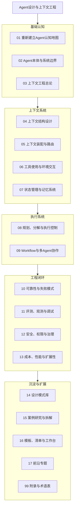

# Agent设计与上下文工程

> [!note] 知识库说明
> **定位**：这不是一套 API 教程，也不是某个框架的使用手册，而是一套面向 `有 Agent 基础开发者` 的系统化知识库。  
> **目标**：帮助你建立稳定的 Agent 设计语言，理解上下文工程的边界、方法与系统约束。  
> **默认读者**：已经接触过 LLM、Prompt、Tool Use、Workflow 或基础 Agent 搭建。  
> **阅读方式**：优先走主线，再按问题索引和场景索引跳转补洞。

---

> [!question] 核心问题
> 当我们说“设计一个 Agent 系统”时，我们究竟在设计什么？
> 是一个 Prompt、一个工作流、一组工具，还是一个由目标、上下文、状态、记忆、执行与评测闭环构成的运行系统？

## 知识地图

## 导航入口

### 1. 主线学习
- [[01-重新建立Agent认知地图]]
- [[02-Agent本体与系统边界]]
- [[03-上下文工程总论]]
- [[04-上下文结构设计]]
- [[05-上下文装配与路由]]
- [[06-工具使用与环境交互]]
- [[07-状态管理与记忆系统]]
- [[08-规划、分解与执行控制]]
- [[09-Workflow与多Agent协作]]
- [[10-可靠性与失败模式]]
- [[11-评测、观测与调试]]
- [[12-安全、权限与治理]]
- [[13-成本、性能与扩展性]]
- [[14-设计模式库]]
- [[15-案例研究与拆解]]
- [[16-模板、清单与工作台]]
- [[17-前沿专题]]

### 2. 辅助导航
- [[00-学习路径]]：按不同目标给出阅读顺序
- [[00-问题索引]]：从“为什么不稳定、为什么贵、为什么失控”切入
- [[00-场景索引]]：按 Coding Agent、Research Agent、知识助手等场景检索
- [[Agent课程编排目录]]：课程式总纲
- [[Agent课程数字花园设计规范]]：页面结构与排版规范

### 3. 收束入口
- [[16-模板、清单与工作台]]：设计模板、评测模板、上线前清单
- [[99-附录与术语表]]：术语、缩写、参考资料

## 推荐学习路径

> [!tip] 推荐路径
> 如果你已经做过 Agent Demo，但对“为什么系统不稳定”仍然没有统一解释，建议先读：
> `01 -> 02 -> 03 -> 04 -> 05 -> 08 -> 10 -> 11`

### 路径 A：建立完整认知
- [[01-重新建立Agent认知地图]]
- [[02-Agent本体与系统边界]]
- [[03-上下文工程总论]]
- [[04-上下文结构设计]]
- [[05-上下文装配与路由]]

### 路径 B：系统设计与落地
- [[06-工具使用与环境交互]]
- [[07-状态管理与记忆系统]]
- [[08-规划、分解与执行控制]]
- [[09-Workflow与多Agent协作]]

### 路径 C：可靠性与工程化
- [[10-可靠性与失败模式]]
- [[11-评测、观测与调试]]
- [[12-安全、权限与治理]]
- [[13-成本、性能与扩展性]]

## 这套知识库要解决的错觉

> [!warning] 常见错觉
> - 把 Agent 问题都理解成 Prompt 问题
> - 把长上下文误当成好上下文
> - 把多 Agent 误当成更高级架构
> - 把“能跑”误当成“可设计、可评估、可维护”

## 建议的知识沉淀方式

- 主线页负责建立框架和判断口径
- 概念页负责术语定义和交叉链接
- 案例页负责迁移应用和失败复盘
- 模板页负责把方法固化为可复用工作台

## 下一步

> [!note] 下一步
> 从 [[01-重新建立Agent认知地图]] 开始，先把 Prompt、Workflow、Agent、上下文工程的边界重新划清；如果你更关心实际搭建顺序，可以直接看 [[00-学习路径]]。
