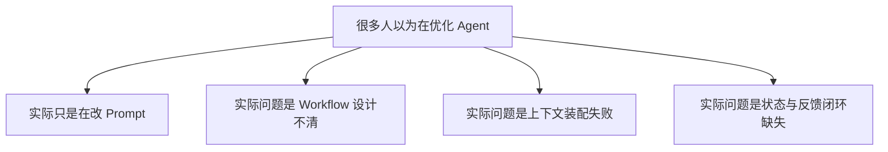
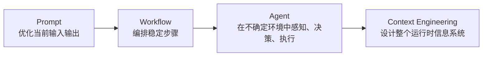
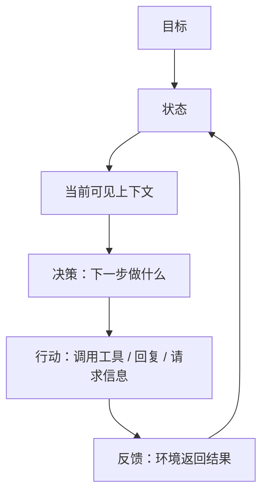
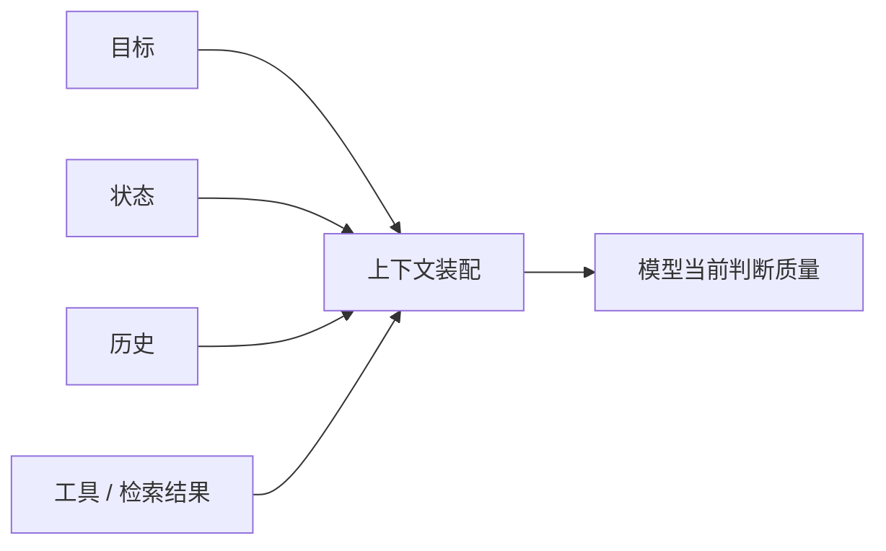

# 01 重新建立 Agent 认知地图

> [!note] 课程说明
> **学习目标**：重新划清 `Prompt`、`Workflow`、`Agent`、`Context Engineering` 的边界，建立一套可复用的判断框架。  
> **前置知识**：你应已经接触过模型调用、Prompt、Tool Use、自动化流程或基础 Agent Demo。  
> **预计时间**：核心阅读 `50-70 分钟`，思考练习 `20-30 分钟`。  
> **本章任务**：不是学一个新术语，而是修正你看待 Agent 问题的坐标系。

---

> [!question] 带着问题阅读
> 为什么很多看似“Agent 不够智能”“模型不够强”“工具不够多”的问题，最后追根溯源都不是模型能力问题，而是我们一开始就没有分清问题属于哪一层？

## 1. 为什么要先重建认知地图

Agent 这个词被用得太宽了。

很多时候，只要一个系统接了大模型、能调几个工具、看起来能自己往下做事，大家就会把它叫做 Agent。这个命名本身并没有太大问题，真正的问题在于：**一旦命名偷懒，设计判断通常也会跟着偷懒。**

于是讨论很快会滑向几个熟悉的方向：

- 模型还不够强
- Prompt 还不够好
- 工具还不够全
- 多 Agent 还没上

这些判断有时没错，但它们常常错在一个更早的地方：**大家把不同层级的问题混在了一起。**

例如：

- 一个本该用固定流程解决的任务，被强行包装成“自主 Agent”
- 一个本质是上下文装配失败的问题，被误判成 Prompt 不够精细
- 一个状态设计不清的问题，被误判成需要长期记忆
- 一个单 Agent 已经足够的场景，被过早升级成多 Agent 协作

> [!abstract] 定义
> 本章所说的“认知地图”，不是概念列表，而是一套用于区分问题层级、识别系统边界、判断优化方向的结构化框架。

如果没有这张地图，后面关于记忆、检索、规划、评测、多 Agent 的讨论都会失焦。因为你会不断试图用错误的层去修复问题。

## 2. Agent 讨论为什么总是从一开始就跑偏

讨论跑偏，通常不是因为信息不够，而是因为默认视角出了问题。

很多开发者第一次接触 Agent，会天然从“模型调用”的视角理解它。这个视角有一个隐含前提：**系统的核心问题，主要是如何让模型输出得更好。**

但当系统开始具备以下特征时，这个前提就不够了：

- 它要处理多轮任务，而不是单轮输出
- 它要依赖外部工具，而不是只靠参数记忆
- 它要在执行中根据反馈修正动作
- 它要在有限上下文里决定什么信息该进、什么信息不该进
- 它要面对不确定环境，而不是预写死的流程

这时，问题已经不再只是“怎么写 Prompt”，而变成：

- 目标有没有定义清楚
- 状态有没有表达出来
- 控制权到底在代码还是模型手里
- 上下文是否被正确装配
- 工具结果是否被正确理解和回流
- 系统如何知道自己何时应该停、何时应该继续

> [!warning] 误区
> 只要问题里出现模型、工具和多轮对话，不代表这个问题就自动升级成了 Agent 设计问题。

## 3. 四个经常被混淆的层级

本章的第一项核心任务，是把四个层级拆开：

- `Prompt`
- `Workflow`
- `Agent`
- `Context Engineering`

它们不是并列替代关系，而是不同抽象层上的问题。

### 3.1 Prompt 解决什么问题

Prompt 解决的是：**如何让模型在当前输入条件下，给出更符合预期的输出。**

它关注的是：

- 任务表达是否清楚
- 角色设定是否明确
- 输出格式是否稳定
- 约束条件是否被说明
- 示例是否足够形成期望

Prompt 很重要，因为它直接决定单轮调用的表达质量。但 Prompt 的边界也很清楚：它主要作用于**当前这一轮输入输出**。

Prompt 不天然解决这些问题：

- 多轮任务如何持续推进
- 工具执行后的结果如何回流
- 系统如何根据环境反馈改变动作
- 状态如何被维护和更新
- 长任务中的信息如何筛选和裁剪

> [!tip] 原则
> Prompt 是局部表达优化工具，不是完整系统结构。

### 3.2 Workflow 解决什么问题

Workflow 解决的是：**如何把多个已知步骤组织成一个稳定、可重复执行的流程。**

它关注的是：

- 步骤顺序
- 输入输出衔接
- 分支条件
- 重试规则
- 流程可靠性

如果你已经知道任务应该分成哪几步，并且大部分决策逻辑可以提前写死，那么 Workflow 往往比 Agent 更合适。

例如：

- 表单提交后做审核、提取、归档、通知
- 把一篇长文固定地拆成摘要、标签、分类和入库
- 每天定时拉取数据、生成报表、发送邮件

这些场景未必不需要模型，但模型通常只是流程中的一个能力节点，而不是整个系统的控制核心。

> [!abstract] 定义
> 当系统的大部分步骤、分支和终止条件都可以在设计时明确写出时，它通常更接近 Workflow，而不是 Agent。

### 3.3 Agent 解决什么问题

Agent 解决的是：**在目标驱动下，系统如何根据当前状态和环境反馈，自主决定下一步动作。**

这里的关键词不是“会调用工具”，而是：

- 有目标
- 有状态
- 有感知
- 有决策
- 有行动
- 有反馈回流

也就是说，Agent 的本质不在于“能不能做事”，而在于“下一步做什么，是否由系统在运行中动态决定”。

一个真正接近 Agent 的系统，通常具备这样的运行闭环：

Agent 不等于“完全自主”，也不等于“什么都交给模型”。它只是意味着：**系统的部分控制权已经从预先写死的流程，转移到了运行时决策。**

### 3.4 Context Engineering 解决什么问题

上下文工程解决的是：**在每一次决策发生之前，模型到底能看到什么信息，这些信息如何被组织、筛选、更新和约束。**

这是很多人最容易低估的一层，因为它看起来很像 Prompt 的延伸，但本质上不是一回事。

Prompt 更像“你怎么说”。

上下文工程更像“你让模型在此刻看见什么世界”。

它关心的问题包括：

- 当前目标有没有被带入这一轮
- 当前状态有没有被明确表达
- 哪些历史信息应该保留
- 哪些工具结果应该进入上下文
- 外部知识该不该检索、何时检索
- 有限 token 预算下，什么信息优先级最高

> [!info] 方法
> 当一个 Agent 在长任务中开始“变笨”，第一反应不应该是换模型，而应该先检查：它在这一轮究竟看到了什么。

## 4. 一个系统到底算不算 Agent

很多争论其实不在于定义，而在于判断口径不统一。

与其问“它是不是 Agent”，不如先问下面这几个问题。

### 4.1 判断问题一：下一步动作是谁决定的

如果系统的下一步动作在设计阶段就已经被写死，例如：

- 先检索
- 再总结
- 再输出 JSON
- 失败就重试两次

那么这个系统更接近 Workflow。

如果系统是在运行中根据状态和反馈来决定：

- 先问用户补信息
- 还是先调工具
- 还是先查历史
- 还是直接结束

那么它更接近 Agent。

### 4.2 判断问题二：系统有没有可更新状态

没有状态的系统，很难形成真正的闭环。

这里的状态不一定是数据库，也不一定是复杂状态机。它至少意味着系统知道：

- 当前任务推进到哪一步
- 已经拿到了哪些信息
- 还缺什么
- 上一次动作的结果是什么

如果系统每一轮都像“重新开始”，那它更像是多轮 Prompt，而不是 Agent。

### 4.3 判断问题三：系统是否依赖环境反馈

真正的 Agent 不是只会连续输出文本，而是会根据环境返回更新判断。

环境反馈可能来自：

- 工具执行结果
- 外部 API 返回
- 用户补充信息
- 文件系统变化
- 检索结果

如果没有反馈回路，所谓“自主执行”常常只是幻觉。

### 4.4 判断问题四：上下文是否在运行中被动态装配

这也是最容易被忽略的一项。

如果每轮模型看到的只是“固定系统提示 + 当前用户输入”，那么系统再复杂，也很难真正进入 Agent 设计层。

当系统开始动态决定：

- 带哪些历史
- 带哪些状态字段
- 带哪些工具结果
- 检索哪些知识
- 删除哪些无关信息

它才开始进入上下文工程的范围。

## 5. 一个更实用的判断框架

为了方便以后分析系统，你可以用下面这张表做快速判断。

| 你在设计什么 | 核心问题 | 控制权主要在谁手里 | 典型特征 |
|---|---|---|---|
| Prompt | 当前这一轮怎么说 | 提示编写者 | 角色、约束、格式、示例 |
| Workflow | 多步骤怎么稳定串起来 | 代码 / 流程编排器 | 步骤明确、分支明确、终止明确 |
| Agent | 下一步动作如何动态决定 | 运行时决策系统 | 感知、决策、行动、反馈闭环 |
| Context Engineering | 每一步决策前模型看到什么 | 上下文装配系统 | 指令、状态、历史、工具结果、检索信息的动态组织 |

> [!tip] 判断口径
> 不要急着问“我要不要做 Agent”。先问：我的问题主要卡在输入表达、流程编排、运行时决策，还是上下文装配。

## 6. 为什么上下文工程是认知升级的分水岭

很多人理解 Agent 的方式，停留在两个动作上：

- 给模型更多指令
- 给模型更多工具

这两件事当然重要，但都还不够。

因为模型并不是在真空里推理。模型的判断质量，取决于它在当前这一步到底能看到什么。

这意味着，真正决定 Agent 上限的，往往不是“模型会不会”，而是：

- 系统有没有把目标带进来
- 系统有没有把状态表达清楚
- 系统有没有把噪音过滤掉
- 系统有没有把必要的工具结果和知识放到正确位置
- 系统有没有在长任务里维持信息密度

如果这些事情没做好，你会看到一种很常见的现象：

- 模型偶尔表现很好
- 但一长任务就开始漂
- 一用工具就容易误解结果
- 一多轮对话就开始遗忘
- 一加历史信息反而更差

这些现象表面上像“模型不稳定”，本质上通常是**运行时信息系统没有被设计好**。

> [!warning] 误区
> 上下文工程不是“把 Prompt 写得更长”，而是“让模型在正确时刻看见正确的信息”。

## 7. 常见错判：把问题修在错误层

第 1 章最重要的收获，不是记住四个术语，而是避免在错误层上修问题。

下面是几种最常见的错判。

### 错判一：把上下文问题修成 Prompt 问题

现象：
- 模型有时答得很好，有时答得很差
- 一旦任务拉长就开始遗漏信息

常见误修：
- 不断往系统提示里追加约束
- 不断增加 few-shot 示例

更可能的真实问题：
- 历史信息带错了
- 状态没有表达出来
- 工具结果没有结构化回流

### 错判二：把 Workflow 问题修成 Agent 问题

现象：
- 任务步骤固定
- 每一步都很确定
- 只是中间某几个环节需要模型能力

常见误修：
- 强行让模型自己规划
- 引入多 Agent 协作

更可能的真实问题：
- 你需要的是更稳定的工作流编排，而不是更高自由度

### 错判三：把状态问题修成记忆问题

现象：
- 系统总忘记当前推进到哪一步
- 用户重复确认后还是“断片”

常见误修：
- 上长期记忆
- 上向量数据库

更可能的真实问题：
- 当前任务状态根本没有被显式表示

### 错判四：把单 Agent 问题修成多 Agent 问题

现象：
- 单 Agent 已经能做事，但稳定性一般

常见误修：
- 再拆出 Planner、Executor、Critic 三个 Agent

更可能的真实问题：
- 你还没先把上下文、状态、工具反馈和评测做好

> [!failure] 反模式判断
> 很多“Agent 架构升级”，实际上不是能力升级，而是把原本未解决的问题分散到更多模块里。

## 8. 本章应当留下的认知结论

读完这一章，你至少应该建立下面这组判断。

- Prompt 主要解决当前输入输出表达问题
- Workflow 主要解决多步骤稳定编排问题
- Agent 主要解决运行中动态决策问题
- Context Engineering 主要解决运行时信息装配问题

更重要的是，你应该开始形成一个新的分析习惯：

当系统表现不好时，不要先问“模型为什么不够聪明”，而先问：

- 问题属于哪一层
- 控制权到底在哪一层
- 信息是不是在错误时刻、以错误方式进入了模型

这张认知地图的意义，不是帮助你给系统贴标签，而是帮助你在设计和排障时，少走弯路。

## 本章结构图

## 一页总结

- 这一章的任务不是解释名词，而是重建分析坐标系。
- `Prompt / Workflow / Agent / Context Engineering` 解决的是不同层级的问题，不能混着修。
- 判断一个系统是不是 Agent，核心看运行时控制权、状态、反馈闭环和动态上下文。
- 很多所谓“Agent 不够聪明”的问题，本质是修错层了。
- 后续整套知识库都会建立在这张认知地图上。

## 思考练习

> [!question] 思考练习
> 选一个你熟悉的 AI 产品、内部工具或 Agent Demo，用下面四步分析它：
> 1. 它的核心问题更接近 `Prompt`、`Workflow`、`Agent` 还是 `Context Engineering`？
> 2. 它的下一步动作是谁决定的？
> 3. 它有没有显式状态？如果有，状态存在哪里？
> 4. 如果它当前表现不稳定，你最先怀疑的是哪一层？

## 核心要点总结

> [!warning] 核心要点总结
> - 不要把所有接了模型的系统都笼统叫做 Agent。  
> - Prompt、Workflow、Agent、上下文工程解决的是不同层级的问题。  
> - Agent 的关键不只是“会调用工具”，而是是否形成了感知、决策、行动、反馈闭环。  
> - 上下文工程不是 Prompt 的附属技巧，而是运行时信息系统设计。  
> - 很多 Agent 优化失败，不是因为没努力，而是因为问题被修在了错误层。

## 下一节预告

> [!note] 下一节预告
> 下一节会进入系统内部，回答一个更具体的问题：如果一个系统真的要被设计成 Agent，它最小需要哪些设计单元，它们之间又是怎样协同工作的。

## 延伸阅读

**必读**

- [Building effective agents | Anthropic](https://www.anthropic.com/engineering/building-effective-agents)
- [Best practices for prompt engineering with the OpenAI API | OpenAI](https://help.openai.com/en/articles/6654000-playground-and-prompt-engineering)

**延伸**

- [ReAct: Synergizing Reasoning and Acting in Language Models](https://arxiv.org/pdf/2210.03629)
- [Context engineering in agents | LangChain](https://docs.langchain.com/oss/javascript/langchain/context-engineering)
