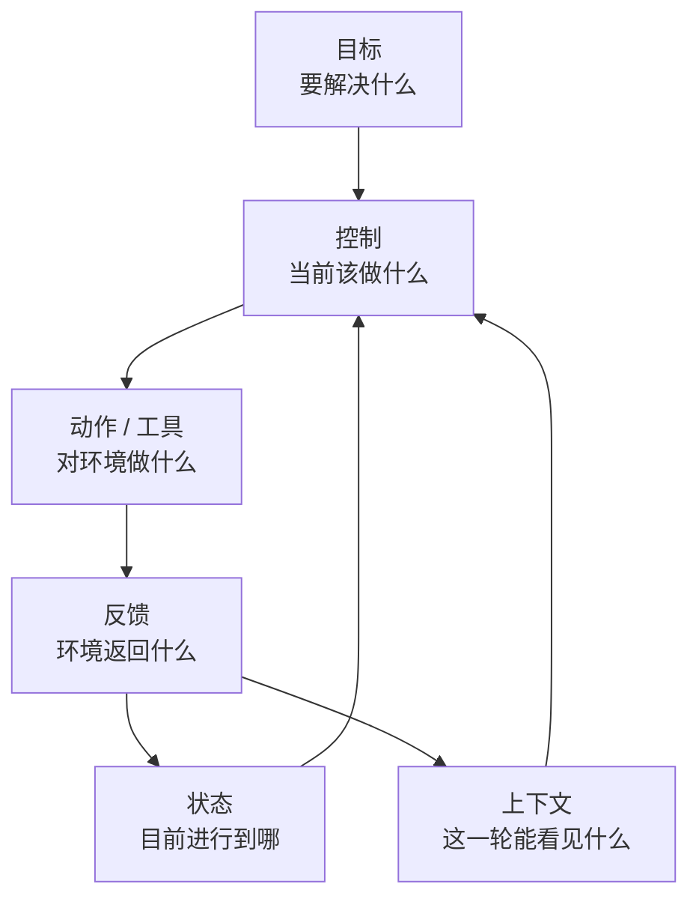
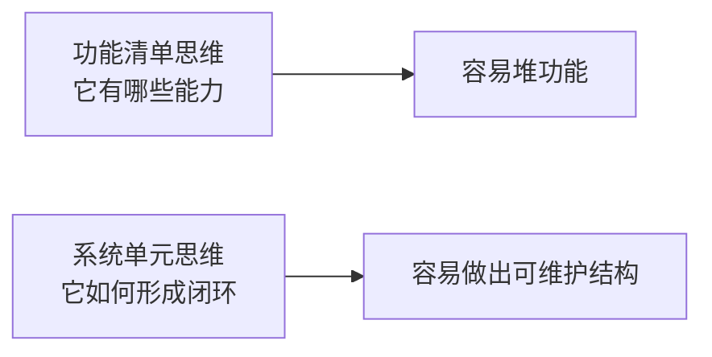
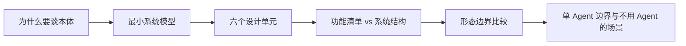

# 02 Agent本体与系统边界

> [!note] 课程说明
> **学习目标**：把 `Agent` 从一个模糊标签，收束成一套最小系统模型；同时建立它和 `Workflow`、`Copilot`、`Automation` 的边界判断。  
> **前置知识**：建议先读完 [[01-重新建立Agent认知地图]]。  
> **预计时间**：核心阅读 `50-70 分钟`，思考练习 `20-30 分钟`。  
> **本章任务**：回答两个问题，`Agent 最少由什么构成`，以及 `什么问题根本不该交给 Agent`。

---

> [!question] 带着问题阅读
> 当我们说“设计一个 Agent”时，我们究竟在设计一个什么系统？如果把 Prompt、工具和流程都剥掉，剩下的最小本体到底是什么？

## 1. 为什么第二章必须讨论“本体”

第 1 章解决的是认知分层问题。

你已经知道：

- Prompt 不是 Agent
- Workflow 不是 Agent
- Context Engineering 也不是 Agent 的同义词

但到这里，仍然有一个问题没有回答：**如果一个系统真的要被称为 Agent，它内部到底最少要有什么？**

如果这个问题不先回答，后续章节很容易继续飘：

- 讲工具时，会把工具清单误当成系统结构
- 讲上下文时，会把上下文误当成 Agent 全部
- 讲记忆时，会把“存了点历史”误当成系统升级
- 讲多 Agent 时，会把拆模块误当成能力增强

所以这一章要做的，不是继续争论术语，而是把 Agent 还原成一个**最小可分析系统**。

> [!abstract] 定义
> 本章所说的“Agent 本体”，不是某个框架里的类名、接口名或产品形态，而是一个系统在成为 Agent 之前，必须具备的最小设计单元及其关系。

## 2. Agent 的最小系统模型

如果从系统角度看，一个 Agent 至少要能完成下面这件事：

> 在一个目标约束下，基于当前状态和可见上下文，对环境做出动作，并根据反馈更新下一步判断。

这句话不长，但已经包含了 Agent 的最小结构。

把它拆开，你会得到六个最基础的单元：

- `目标`
- `状态`
- `上下文`
- `动作 / 工具`
- `控制`
- `反馈`

这个模型有两个关键点。

第一，Agent 不是一个“会输出文本的盒子”，而是一个持续运行的控制系统。

第二，Agent 的关键不在任何单个单元上，而在于这些单元是否形成了闭环。只有目标、没有状态，不行；只有工具、没有反馈，也不行；只有上下文、没有控制逻辑，同样不行。

> [!tip] 原则
> 看一个系统是不是 Agent，先不要看它调了多少工具。先看它有没有形成 `目标 -> 控制 -> 动作 -> 反馈 -> 状态更新` 的闭环。

## 3. 六个最小设计单元

### 3.1 目标：系统为什么而行动

目标回答的是：**这个 Agent 到底要完成什么。**

听起来很简单，但很多系统在这里一开始就模糊了。常见问题包括：

- 把功能描述当成目标
- 把用户输入当成目标
- 把“尽可能帮助用户”当成目标

这些表达都太宽了。

一个可用于 Agent 设计的目标，至少应包含：

- 成功标准
- 约束条件
- 完成边界

例如，“帮用户完成旅行规划”不是一个足够好的系统目标。

更好的表达会是：

- 在用户预算、时间和地点约束下，产出可执行的行程草案
- 当缺少关键信息时先补问，而不是臆测
- 当外部信息不足时明确说明不确定性

> [!warning] 误区
> 如果目标没有成功标准，系统就不知道什么叫“完成”；如果目标没有边界，系统就容易持续扩张任务范围。

### 3.2 状态：系统目前进行到哪

状态回答的是：**系统现在知道什么、做到哪了、还缺什么。**

没有状态，系统就只能一轮一轮地“临场发挥”。

状态不一定复杂，但它至少要能够表达：

- 当前任务阶段
- 已确认信息
- 待确认信息
- 上一个动作的结果
- 是否需要中断、重试或结束

如果这些东西都没有显式表达，系统很容易出现两类问题：

- 已做过的事情重复做
- 已失败的路径反复撞

状态是后续记忆系统的前提。你不能指望“有了长期记忆”，就自动补上当前任务状态的缺口。

### 3.3 上下文：当前这一轮能看见什么

上下文回答的是：**在本轮决策时，模型到底看到了哪些信息。**

第 3 至第 5 章会详细讲上下文工程，但在本章你先要把它视为 Agent 本体的一部分，而不是外围配置。

因为没有上下文，控制单元就没有输入；而上下文设计错误，控制单元就会在错误信息上做出“看似合理”的决策。

在最小系统模型里，上下文至少要承载：

- 当前目标
- 当前状态摘要
- 当前轮真正相关的历史
- 必要的工具或环境结果

一个常见误解是：上下文越多越好。实际上，**对 Agent 来说，错误信息进入上下文和关键信息缺失，一样致命。**

### 3.4 动作与工具：系统如何作用于环境

动作回答的是：**系统下一步能做什么。**

它可能是：

- 回复用户
- 请求补充信息
- 调用外部 API
- 读取文件
- 写入数据库
- 执行命令

工具只是动作的一种具体实现方式。

这也是为什么“会调工具”本身不足以定义 Agent。因为工具只说明系统有手，没有说明它有没有眼睛、脑子和记忆。

一个成熟的动作层，至少要回答三件事：

- 可用动作集合是什么
- 每个动作的前提条件是什么
- 动作结果如何回流系统

### 3.5 控制：当前该做什么

控制回答的是：**面对当前目标、状态和上下文，系统如何选择下一步动作。**

这是 Agent 最接近“本体”的部分，因为这里才真正涉及运行时决策。

控制不等于某一种固定算法，也不等于一定要显式计划。它可以很轻，也可以很重，但必须承担以下责任：

- 判断下一步动作
- 决定是否继续
- 决定是否中断
- 决定是否请求澄清
- 决定是否结束

从工程角度看，Agent 和普通自动化流程的差别，往往不在动作集合，而在控制权分配。

如果控制几乎全部在流程代码里，系统更接近 Workflow。
如果控制的关键部分在运行时根据状态和反馈动态产生，系统才更接近 Agent。

### 3.6 反馈：系统如何知道刚才发生了什么

反馈回答的是：**系统如何获取动作结果，并把结果变成下一轮决策的输入。**

很多 Agent 原型能“跑起来”，但跑不稳，问题不在工具本身，而在反馈设计太弱。

常见弱反馈包括：

- 只拿到原始文本结果，没有结构化信号
- 工具失败了，但系统看不懂失败原因
- 外部环境变化了，但状态没有更新
- 用户已经拒绝某条路径，但系统没有纳入判断

反馈的质量，直接决定 Agent 能不能真的闭环，而不是假装闭环。

> [!info] 方法
> 如果你怀疑一个 Agent 只是“看起来像闭环”，去检查它的反馈链路：动作结果是怎样写回系统的，状态又是怎样更新的。

## 4. Agent 的本体不是功能清单

很多团队在做 Agent 设计时，第一份文档往往长这样：

- 支持搜索
- 支持浏览网页
- 支持调用内部 API
- 支持文件读写
- 支持多轮对话

这类列表有用，但它不构成系统设计。

因为它回答的是“系统能做什么”，而不是“系统如何运作”。

真正的 Agent 设计文档，应至少能回答：

- 系统的目标是什么
- 系统有哪些状态
- 模型每轮看见什么
- 系统能做哪些动作
- 下一步动作怎么决定
- 动作结果如何影响下一轮

> [!tip] 原则
> 功能列表适合做产品介绍，系统单元适合做 Agent 设计。

## 5. Agent、Copilot、Workflow、Automation 的边界

第 1 章解决了概念分层，这一节进一步把几个常见形态放在一起比较。

### 5.1 Automation：固定规则执行

Automation 的核心是：**规则先写好，系统按规则执行。**

它通常具备：

- 明确触发条件
- 明确执行步骤
- 明确异常处理
- 最少的运行时自由度

例如定时同步数据、文件重命名、规则通知、固定报表生成。

它可以完全不需要模型。

### 5.2 Workflow：固定流程里的模型能力节点

Workflow 的核心是：**步骤结构是稳定的，模型只是其中某些节点的能力提供者。**

例如：

- 先抽取信息
- 再分类
- 再生成摘要
- 再人工审核
- 最后入库

这里即便有模型，也不代表系统进入 Agent 层。

### 5.3 Copilot：人在主控，系统给辅助

Copilot 的核心是：**人是主控者，系统负责建议、补全、解释或执行局部操作。**

它通常具备：

- 明确的人类主循环
- 高频交互
- 较低的自主推进深度
- 人工确认占主导

例如代码补全助手、文档写作助手、界面内嵌的 AI 辅助操作。

Copilot 可能会用到 Agent 技术，但产品形态上它不等于一个自主 Agent。

### 5.4 Agent：系统拥有部分运行时控制权

Agent 的核心是：**在既定边界内，系统拥有部分运行时控制权，可以自己判断下一步。**

这意味着：

- 它不完全依赖预写死流程
- 它不完全依赖人逐步指挥
- 它会基于状态和反馈做局部自主判断

### 5.5 一张对照表

| 形态 | 核心控制权 | 适合的问题 | 风险点 |
|---|---|---|---|
| Automation | 规则 | 重复、稳定、边界清楚 | 适应性弱 |
| Workflow | 流程编排器 | 多步骤、可分解、分支已知 | 流程僵化 |
| Copilot | 人 | 高价值、需人审、交互密集 | 自动化深度有限 |
| Agent | 运行时决策系统 | 环境不确定、需动态选择下一步 | 稳定性、可控性、评测难度上升 |

> [!warning] 误区
> 不要把 “Agent” 当成成熟度更高的统称。很多场景里，Automation 或 Workflow 其实是更优解。

## 6. 单 Agent 的能力边界

单 Agent 很重要，因为它是绝大多数系统的正确起点。

但单 Agent 也有非常明确的边界。

### 6.1 单 Agent 擅长什么

单 Agent 适合以下类型的问题：

- 目标相对统一
- 决策中心不需要拆分
- 工具集规模可控
- 反馈链路较短
- 状态复杂度还在人能理解的范围内

例如：

- 帮用户完成一次研究任务
- 对一个代码库做定向分析
- 协助完成一份结构化输出

### 6.2 单 Agent 不擅长什么

当任务开始出现这些特征时，单 Agent 往往会吃力：

- 同时维护多个相互独立的子目标
- 需要长期运行和跨会话续跑
- 工具种类过多，动作空间失控
- 状态过于复杂，单一控制环难以稳定
- 需要非常强的专业隔离或权限隔离

这时问题未必一定要升级成多 Agent，但至少说明：单 Agent 的简单闭环开始接近极限。

### 6.3 不要把单 Agent 的问题过早升级成多 Agent

这是一个非常常见的误区。

单 Agent 不稳定，很多团队的第一反应是：

- 再加一个 Planner
- 再加一个 Critic
- 再加一个 Router

结果往往是：

- 模块更多
- 成本更高
- 调试更难
- 责任边界更模糊

而最初的问题，其实只是：

- 目标没写清
- 状态没显式表达
- 上下文装配太乱
- 工具反馈没结构化

> [!failure] 反模式判断
> 当一个系统连单 Agent 闭环都没有跑稳时，过早引入多 Agent，通常不是架构升级，而是复杂度外溢。

## 7. 什么问题根本不该用 Agent 解决

讨论 Agent，最成熟的表现之一，不是会设计 Agent，而是知道什么时候别用。

下面几类问题，通常不应该优先用 Agent。

### 7.1 规则已经足够明确的问题

如果：

- 步骤固定
- 分支已知
- 异常路径有限
- 执行标准明确

那通常优先用 Automation 或 Workflow。

### 7.2 高风险且无法有效监督的问题

如果一个动作代价很高，例如：

- 财务操作
- 外部发送
- 数据删除
- 权限变更

而系统又无法引入明确确认和审计机制，那么不应该让 Agent 直接拥有执行权。

### 7.3 输入极度模糊但又要求绝对稳定的问题

Agent 擅长在不确定环境中做相对合理的决策，不擅长在输入高度模糊的前提下，还保证完全稳定、完全可预测。

如果业务要求极端稳定，容错空间很小，那么应当优先压缩自由度，而不是提高自主度。

### 7.4 没有评测手段的问题

如果你无法定义：

- 什么叫成功
- 什么叫失败
- 怎样复现实验
- 怎样比较两个版本

那你其实还没准备好做 Agent。因为 Agent 比普通功能更依赖持续评测。

## 8. 一个可复用的系统检查清单

到这里，你应该能用一张简单清单来检查一个系统是否具备 Agent 本体。

### 8.1 最小本体检查

- 是否有明确目标，而不是宽泛功能口号
- 是否有显式状态，而不是完全靠对话历史硬撑
- 是否有可用动作集合，而不是只会文本输出
- 是否有运行时控制，而不是所有步骤都预写死
- 是否有反馈回流，而不是动作做完就结束
- 是否能根据反馈更新状态和下一步判断

### 8.2 边界检查

- 这个问题真的需要运行时决策吗
- 这个问题是不是 Workflow 已经足够
- 这个问题是不是 Copilot 更安全
- 这个问题是否应该先做成 Automation

### 8.3 风险检查

- 工具动作是否高风险
- 状态是否可解释
- 失败是否能被观测
- 是否能定义评测标准

> [!tip] 使用建议
> 在真正设计 Agent 之前，先把这张清单过一遍。很多所谓“架构选择”，到最后只是边界选择。

## 9. 本章应当留下的认知结论

这一章最重要的收获，不是记住六个单元，而是形成系统视角。

你应该开始把 Agent 看成：

- 一个围绕目标运行的控制系统
- 一个由状态、上下文、动作、控制、反馈构成的闭环
- 一个控制权部分下放到运行时的系统
- 一个有明确边界、明确代价、明确适用场景的结构

同时你也应该建立一个更成熟的判断：

不是所有复杂系统都值得做成 Agent。

在很多场景中，真正高质量的工程选择，恰恰是：

- 把自由度收回来
- 把流程写明确
- 把高风险动作关到确认机制里
- 把系统保持在 Workflow 或 Copilot 层

## 本章结构图

## 一页总结

- Agent 本体不是框架名词，而是目标、状态、上下文、动作、控制、反馈形成的闭环。
- 工具多不代表系统成熟，关键在于闭环是否成立。
- `Automation / Workflow / Copilot / Agent` 的区别主要在控制权分配。
- 单 Agent 是正确起点，但并不是所有问题都该升级成 Agent。
- 成熟判断的一部分，是知道什么时候主动收回自由度。

## 思考练习

> [!question] 思考练习
> 选一个你熟悉的 AI 系统或内部工具，用下面的问题分析它：
> 1. 它的目标是否足够明确？
> 2. 它有没有显式状态？
> 3. 它的控制权主要在人、流程，还是运行时决策系统手里？
> 4. 它更接近 Automation、Workflow、Copilot 还是 Agent？
> 5. 如果它当前不稳定，问题更可能出在六个最小单元中的哪一个？

## 核心要点总结

> [!warning] 核心要点总结
> - Agent 不是功能清单，而是一个由目标、状态、上下文、动作、控制、反馈构成的闭环系统。  
> - 工具很多，不代表系统已经具备 Agent 本体。  
> - Agent、Workflow、Copilot、Automation 的关键区别，在于控制权分配和运行时自由度。  
> - 单 Agent 是正确起点，但它有明确边界，不要用多 Agent 掩盖基础设计问题。  
> - 知道什么时候不该用 Agent，是成熟设计判断的一部分。

## 下一节预告

> [!note] 下一节预告
> 下一节会进入一个更关键、也更容易被低估的主题：上下文工程。我们会正式回答，为什么很多 Agent 的上限，实际上不是由模型能力决定，而是由运行时信息系统决定。

## 延伸阅读

**必读**

- [Building effective agents | Anthropic](https://www.anthropic.com/engineering/building-effective-agents)
- [LangGraph overview | LangChain Docs](https://docs.langchain.com/oss/python/langgraph/overview)

**延伸**

- [ReAct: Synergizing Reasoning and Acting in Language Models](https://arxiv.org/pdf/2210.03629)
- [Toolformer: Language Models Can Teach Themselves to Use Tools](https://huggingface.co/papers/2302.04761)
