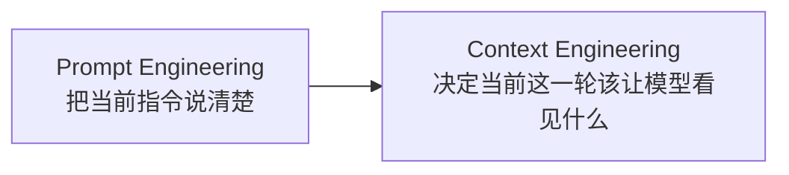
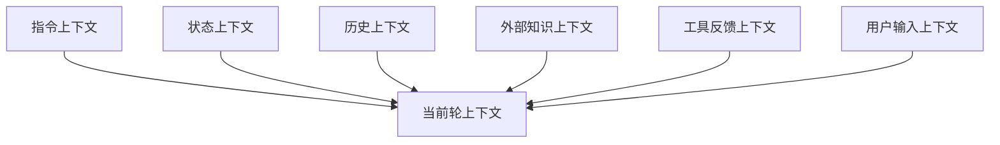

# 03 上下文工程总论

> [!note] 课程说明
> **学习目标**：把“上下文”从一个模糊输入框概念，提升为 Agent 系统中的运行时信息系统。  
> **前置知识**：建议先读完 [[01-重新建立Agent认知地图]] 和 [[02-Agent本体与系统边界]]。  
> **预计时间**：核心阅读 `55-75 分钟`，思考练习 `20-30 分钟`。  
> **本章任务**：回答四个问题，`什么是上下文工程`、`上下文由什么组成`、`上下文为什么决定 Agent 上限`、`上下文为什么经常失真`。

---

> [!question] 带着问题阅读
> 为什么很多 Agent 一开始表现还不错，但任务一拉长、工具一接入、历史一变多，系统就开始漂、开始忘、开始做错事？如果模型本身没变，真正变差的到底是什么？

## 1. 为什么第 3 章必须单独讲上下文工程

在前两章里，你已经建立了两个基础判断。

第一，Agent 不是 Prompt，也不是 Workflow。

第二，Agent 至少由目标、状态、上下文、动作、控制、反馈这些单元构成。

但到这里，还有一个关键问题没有被正面展开：**在每一次决策发生之前，模型究竟是靠什么做判断的？**

答案当然是“靠它看到的信息”。

而这个答案看似简单，实际上决定了后面几乎所有章节的地基。因为无论你讨论的是：

- 工具调用
- 记忆系统
- 任务规划
- 多 Agent 协作
- 评测与调试

最后都会回到同一个现实问题：**模型在当前这一轮到底看见了什么，以及为什么是这些信息。**

如果这个问题没有被系统设计，Agent 的运行方式就会退化成一种碰运气的模式：

- 这轮刚好拿到了关键线索，于是表现很好
- 下一轮信息被淹没，于是开始偏航
- 某次工具结果被错误理解，于是整条链路一起失真

> [!abstract] 定义
> 本章所说的“上下文工程”，不是“把 Prompt 写得更长”，而是对模型每一轮决策前可见信息的来源、结构、装配、更新与约束进行系统化设计。

## 2. 从 Prompt Engineering 到 Context Engineering

很多开发者最早接触大模型时，主要关注的是 Prompt。

这种视角在单轮任务里足够有效，因为那时问题通常是：

- 指令有没有说清
- 格式有没有规定好
- 示例有没有给足

但当系统进入 Agent 设计层，Prompt 很快就不够用了。原因不是 Prompt 失效，而是问题本身升级了。

### 2.1 Prompt 工程主要在优化什么

Prompt Engineering 主要优化的是：

- 当前任务表达
- 当前角色设定
- 当前输出格式
- 当前行为约束

它是针对“这一次调用”做表达优化。

### 2.2 上下文工程主要在优化什么

Context Engineering 主要优化的是：

- 这一次调用前，模型应当看到哪些信息
- 这些信息如何组织
- 哪些信息必须被保留
- 哪些信息必须被裁掉
- 这些信息在不同轮次如何更新

它不是只优化一句话怎么写，而是在设计一个运行时信息系统。

一个很实用的理解方式是：

- Prompt 关心“怎么说”
- Context Engineering 关心“让它在此刻看见什么”

两者并不冲突，但抽象层完全不同。

> [!tip] 原则
> 当任务从单轮输出升级成持续运行系统时，Prompt 会退到局部，而上下文工程会上升为系统层。

## 3. 上下文到底是什么

在很多日常讨论里，“上下文”这个词被用得过宽，常常等同于：

- 聊天历史
- 系统提示
- 长上下文窗口

这些都只是上下文的一部分。

如果从 Agent 运行的角度看，上下文更准确的定义是：

> 在当前决策时刻，模型能够访问并用于推理的全部有效信息集合。

这个定义里有两个词很关键。

第一个词是“当前”。

上下文不是一份永远固定的文档，而是一个随轮次变化的运行时切片。

第二个词是“有效”。

并不是进入输入框的所有内容，都能以正确方式被模型利用。无关信息、过时信息、冲突信息和低质量摘要，都会降低上下文质量。

### 3.1 上下文不是“输入越多越好”

这几乎是 Agent 设计里最常见的直觉错误。

很多人会天然觉得：

- 信息越多越安全
- 历史越全越稳
- 上下文窗口越长越强

但实际情况通常相反。

如果上下文没有经过设计，更多信息往往带来的不是更强判断，而是：

- 注意力稀释
- 目标模糊
- 关键状态被埋没
- 旧信息干扰当前判断
- 成本和延迟上升

所以对 Agent 来说，真正重要的不是“能塞多少”，而是“该塞什么，不该塞什么”。

## 4. 上下文由哪些部分组成

从系统设计角度看，一个 Agent 在某一轮常见的上下文来源通常包括以下几类。

### 4.1 指令上下文

这部分回答的是：**系统此刻应该遵守什么原则和目标。**

它通常包括：

- System Prompt
- 角色定义
- 行为约束
- 当前任务目标
- 成功标准

这部分给的是方向，但不给事实。

### 4.2 状态上下文

这部分回答的是：**系统目前推进到哪一步。**

它通常包括：

- 当前阶段
- 已确认信息
- 待确认信息
- 上一轮关键结果
- 当前中断点或待办项

状态上下文的作用，是让模型不要每轮都像重新开始。

### 4.3 历史上下文

这部分回答的是：**此前发生过哪些仍与当前决策相关的事情。**

它可能来自：

- 对话历史
- 历史工具调用
- 之前的中间结论
- 历史任务片段

这里最容易出问题的地方是：历史很容易被机械保留，却没有经过“是否仍然相关”的筛选。

### 4.4 外部知识上下文

这部分回答的是：**模型参数之外，还有哪些外部信息需要被带入。**

它可能来自：

- 检索结果
- 知识库内容
- 文档片段
- 数据库记录

这类上下文的关键不在“查没查”，而在“查回来的东西是否真的可用”。

### 4.5 工具反馈上下文

这部分回答的是：**环境刚刚返回了什么，系统因此该如何更新判断。**

它可能来自：

- API 响应
- 文件读取结果
- 命令执行结果
- 浏览器操作结果

工具反馈如果没有被结构化，很容易变成一大段原始文本，既占 token，又不利于模型抓住真正信号。

### 4.6 用户输入上下文

这部分回答的是：**当前轮用户刚刚表达了什么新的需求、修正或限制。**

它看似最直观，但在复杂系统里未必永远是优先级最高的一层。因为用户当前说的一句话，可能必须放回目标、状态和历史里，才能被正确理解。

> [!info] 方法
> 当你分析一个 Agent 当前为什么判断失真时，不要只看系统提示。把它这一轮拿到的六类上下文按来源重新列一遍，问题通常会立刻清楚很多。

## 5. 上下文的结构、不是内容堆砌

上下文设计里，一个经常被忽视的问题是结构。

很多系统把不同类型的信息简单拼接在一起：

- 一段系统提示
- 一段用户历史
- 一段检索结果
- 一段工具返回

表面看信息都在，实际问题很多。

因为模型并不会自动替你完成这些工作：

- 区分什么是目标、什么是状态
- 判断什么是历史事实、什么是刚发生的新结果
- 决定什么是高优先级约束、什么是低优先级参考

如果结构不清，模型就只能在混杂信息里“自己猜”。

这时你看到的现象往往是：

- 某些轮次表现很好
- 某些轮次突然忽略关键约束
- 工具结果明明在上下文里，却没有被正确使用

> [!warning] 误区
> 上下文工程失败，很多时候不是信息不够，而是信息没有被按可推理结构组织。

## 6. 上下文是有生命周期的

上下文不是一次性组装品，而是动态变化的。

一个任务刚开始时，需要的信息，和任务进行到中途、结束前，需要的信息通常并不一样。

这意味着上下文至少有生命周期问题：

- 什么时候进入
- 保留多久
- 什么时候降级
- 什么时候删除

### 6.1 进入

不是所有信息都应该一开始就进入上下文。

例如：

- 某些工具结果要等执行后才会出现
- 某些外部知识只有在任务需要时才值得检索
- 某些历史只有在当前轮相关时才值得带入

### 6.2 保留

进入上下文的信息，不代表应该永久保留。

一些信息只在局部决策里有价值，过了那个时刻就应当被摘要、降级或清除。

### 6.3 更新

上下文里的很多内容不是静态事实，而是动态字段。

例如：

- 当前阶段
- 已完成动作
- 待确认问题
- 最新工具结果

如果这些字段不更新，系统就会在过时信息上持续做判断。

### 6.4 淘汰

所有长任务最终都会面对淘汰问题。

因为：

- token 有限
- 注意力有限
- 成本有限

所以真正成熟的上下文系统，必须考虑什么信息应该被摘要、替换、外置或直接删除。

## 7. 为什么上下文决定 Agent 上限

很多 Agent 系统的上限，并不是被模型参数决定的，而是被上下文质量决定的。

原因很直接。

模型再强，也只能在它当前看到的信息上做判断。

如果当前轮里：

- 目标不清
- 状态缺失
- 历史过载
- 工具结果混乱
- 外部知识失准

那模型再强，做出的也只能是建立在错误地基上的“看似合理推理”。

这就是为什么很多系统会出现一种很典型的错觉：

- 有时非常聪明
- 有时突然非常笨

这种不稳定感，很多时候并不是模型人格分裂，而是输入给它的运行时世界本身就在波动。

### 7.1 上下文决定判断质量

模型是在当前轮上下文里做局部最优判断。

所以当前轮上下文的完整性、相关性、结构清晰度，直接决定判断质量。

### 7.2 上下文决定控制质量

Agent 的控制单元要决定：

- 现在该做什么
- 还缺什么
- 应不应该继续

如果输入给控制单元的信息不对，控制就会失真。

### 7.3 上下文决定系统可扩展性

当系统开始接工具、接检索、接记忆、接长任务时，复杂度首先爆炸的地方不是模型调用本身，而是上下文系统。

因为每接入一个新能力，都会增加新的信息来源、新的优先级冲突和新的生命周期管理问题。

> [!tip] 原则
> 模型能力决定理论上限，上下文工程决定运行时上限。

## 8. 上下文为什么经常失真

理解上下文工程，不能只讲它应该是什么，还要讲它为什么总会坏。

常见失真通常有四类。

### 8.1 上下文污染

指不该进入当前轮的信息进入了上下文。

例如：

- 过时历史
- 无关检索结果
- 与当前任务冲突的旧约束
- 噪声很大的工具输出

污染的可怕之处在于，它经常不是显眼错误，而是以“看起来也有点道理”的方式影响判断。

### 8.2 上下文漂移

指随着轮次增加，系统逐渐偏离原始目标、边界或任务定义。

典型表现包括：

- 越做越偏题
- 把局部中间结果当成最终目标
- 把一次临时决策误当成长期规则

漂移通常不是突然发生的，而是在多轮累积中慢慢形成。

### 8.3 上下文过载

指系统把太多信息硬塞进当前轮，导致：

- 关键线索被埋
- 注意力稀释
- token 成本上升
- 响应延迟上升

过载并不意味着所有信息都无用，而是意味着当前轮的信息密度已经失衡。

### 8.4 上下文断裂

指本该持续存在的重要信息，在某一轮突然消失了。

例如：

- 当前目标没有继续带入
- 状态摘要丢失
- 上轮工具结论没传下去
- 用户明确限制被遗忘

断裂和污染一样危险，只不过它表现为“缺关键事实”，而不是“多了噪音”。

## 9. 一个更实用的上下文判断框架

为了以后分析系统，你可以用下面四个问题快速检查上下文质量。

### 9.1 它看见的是不是当前真正需要的信息

不是越多越好，而是越贴合当前决策越好。

### 9.2 它看见的信息是否被正确分类

目标、状态、历史、工具结果、检索结果，不能混成一锅。

### 9.3 它看见的信息是不是最新的

过时状态、旧摘要、旧工具结果，都会让系统在“历史残影”上行动。

### 9.4 它没看见的，是否刚好是关键缺口

很多问题不是信息太多，而是缺的恰好是最关键那一块。

> [!info] 方法
> 调试 Agent 时，与其问“模型为什么这么想”，不如先问“系统让它看见了什么，没让它看见什么”。

## 10. 本章应当留下的认知结论

读完这一章，你至少应该建立以下判断。

- 上下文不是聊天历史的别名，而是当前轮全部有效信息集合
- 上下文工程不是写长 Prompt，而是设计运行时信息系统
- 上下文至少涉及来源、结构、装配、更新和淘汰
- 长上下文不等于高质量上下文
- 很多 Agent 的不稳定，本质是上下文系统失真

更重要的是，你应该开始接受一个现实：

Agent 的智能感，很多时候不是直接来自模型“更会想”，而是来自系统“更会给它看对的信息”。

## 本章结构图

## 一页总结

- 上下文不是聊天历史的别名，而是当前轮全部有效信息集合。
- 上下文工程不是写长 Prompt，而是在设计运行时信息系统。
- 真正要管理的是来源、结构、更新、淘汰和失真。
- Agent 的上限常常先卡在上下文质量，而不是模型能力。
- 理解这一章，是后面结构设计、装配、记忆和评测的共同前提。

## 思考练习

> [!question] 思考练习
> 选一个你熟悉的 Agent 或 AI 系统，尝试回答下面的问题：
> 1. 它当前轮的上下文主要来自哪些来源？
> 2. 它有没有把目标、状态、历史、工具结果混在一起？
> 3. 它最容易出现的是污染、漂移、过载，还是断裂？
> 4. 如果要优先优化一项上下文问题，你会先改哪一层？

## 核心要点总结

> [!warning] 核心要点总结
> - 上下文工程的核心，不是“多给模型一些信息”，而是“在正确时刻给它正确的信息”。  
> - 上下文是运行时信息系统，不是一次性输入拼装。  
> - 上下文的关键问题包括来源、结构、生命周期和失真治理。  
> - 很多 Agent 的上限，不是先卡在模型能力，而是先卡在上下文质量。  
> - 理解上下文工程，是后续讨论结构设计、装配策略、记忆系统和评测方法的前提。

## 下一节预告

> [!note] 下一节预告
> 下一节会把总论继续往前推进，进入更具体的“上下文结构设计”：哪些信息层应该固定，哪些应该动态变化，System Prompt 到底该承担什么，不该承担什么。

## 延伸阅读

**必读**

- [Context engineering in agents | LangChain](https://docs.langchain.com/oss/javascript/langchain/context-engineering)
- [Context overview | LangChain Docs](https://docs.langchain.com/oss/javascript/concepts/context)

**延伸**

- [Lost in the Middle: How Language Models Use Long Contexts](https://direct.mit.edu/tacl/article/doi/10.1162/tacl_a_00638/119630/Lost-in-the-Middle-How-Language-Models-Use-Long)
- [Building effective agents | Anthropic](https://www.anthropic.com/engineering/building-effective-agents)
