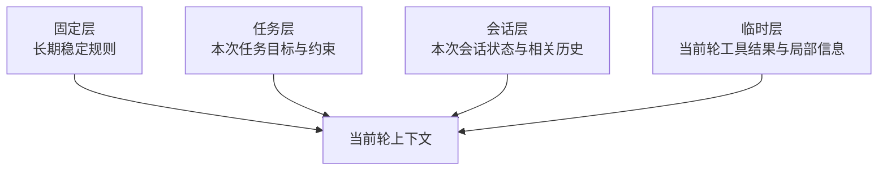

# 04 上下文结构设计

> [!note] 课程说明
> **学习目标**：把“上下文里应该放什么”进一步推进到“这些信息应该按什么结构存在”。  
> **前置知识**：建议先读完 [[03-上下文工程总论]]。  
> **预计时间**：核心阅读 `50-70 分钟`，思考练习 `20-30 分钟`。  
> **本章任务**：回答四个问题，`System Prompt 该承担什么`、`上下文应该如何分层`、`状态和约束如何表达`、`如何把上下文设计成可维护接口`。

---

> [!question] 带着问题阅读
> 为什么有些 Agent 明明“信息都给了”，但模型还是经常忽略关键约束、误读工具结果、把旧历史当成新事实？问题到底出在信息不够，还是出在信息没有按可推理结构组织？

## 1. 为什么第 4 章要讨论“结构”

第 3 章已经说明，上下文不是一堆随手拼起来的输入，而是一个运行时信息系统。

但如果只停在“来源有哪些”这一层，仍然不够。因为即使你已经知道：

- 当前目标要进上下文
- 当前状态要进上下文
- 某些历史要进上下文
- 工具结果和检索结果也要进上下文

系统仍然可能表现很差。

原因很简单：**知道哪些信息该进，不等于知道这些信息应该以什么结构存在。**

很多上下文失败，并不是因为缺信息，而是因为信息结构太差：

- 目标和约束混在一起
- 状态和历史混在一起
- 工具结果和解释性文字混在一起
- 临时信息和长期规则混在一起

当结构混乱时，模型虽然“看见了很多内容”，但它很难稳定判断：

- 哪些是高优先级规则
- 哪些是当前状态字段
- 哪些是历史参考
- 哪些只是低优先级背景

> [!abstract] 定义
> 本章所说的“上下文结构设计”，指的是把不同类型的信息按职责、稳定性、生命周期和优先级进行分层建模，让模型能在可推理结构上做判断，而不是在信息混合物里碰运气。

## 2. 结构设计要先回答什么问题

在开始写任何 Prompt 模板之前，更值得先回答的是下面几个问题：

- 哪些信息是长期稳定不变的
- 哪些信息会随任务变化
- 哪些信息只在当前会话里有效
- 哪些信息只在某一轮临时存在
- 哪些信息应该作为规则
- 哪些信息应该作为状态
- 哪些信息只配当参考，不配当约束

这些问题如果不先回答，后面的“写 Prompt”很容易变成一种伪设计：看起来写了很多，实际上只是在往一个大字符串里不断追加内容。

## 3. 一个实用的上下文分层模型

对大多数 Agent 来说，可以先用一个足够实用的四层模型来思考上下文结构：

- `固定层`
- `任务层`
- `会话层`
- `临时层`

这不是唯一正确结构，但它足够把大量常见混乱先切开。

### 3.1 固定层：长期稳定规则

固定层承载的是那些不应频繁变化的规则。

典型内容包括：

- 系统角色
- 核心行为原则
- 安全约束
- 输出基调
- 高优先级禁令

固定层的职责是提供**稳定边界**，不是承担所有信息。

如果你把任务目标、用户偏好、当前状态、工具结果都塞进固定层，它就不再是固定层，而只是一个不断膨胀的总提示。

### 3.2 任务层：本次任务定义

任务层承载的是这一轮任务或这一次子任务的定义。

典型内容包括：

- 当前任务目标
- 成功标准
- 本次任务约束
- 当前任务的完成条件

任务层的特点是：它比固定层更易变化，但通常比会话层更稳定。

一个常见错误是把任务层写得太泛。例如：

- “尽可能帮助用户”
- “完成用户需求”

这样的描述无法帮助模型区分：

- 当前任务的边界
- 哪些约束优先级更高
- 什么叫本轮已经完成

### 3.3 会话层：当前推进状态

会话层承载的是当前会话或当前任务推进过程中的动态状态。

典型内容包括：

- 当前阶段
- 已确认事实
- 待确认问题
- 当前待办项
- 已有中间结论

会话层的作用，是让系统在连续多轮中仍然有“现在进行到哪里”的感知。

没有这一层，模型就会不断把每一轮都当作新的起点。

### 3.4 临时层：当前轮局部信息

临时层承载的是只对当前轮或当前局部决策有价值的信息。

典型内容包括：

- 刚返回的工具结果
- 当前轮检索结果
- 临时对比信息
- 某个局部子问题的中间材料

临时层最容易过载，因为工程上最方便的做法，往往就是把一切新结果直接追加进来。

但临时层如果不被控制，就会迅速污染整个上下文系统。

> [!tip] 原则
> 结构设计的第一步，不是想“我要写多少提示”，而是先把信息按稳定性和生命周期分层。

## 4. System Prompt 到底该承担什么

这是上下文结构设计里最容易被误用的部分。

很多团队习惯把所有重要信息都塞进 System Prompt，原因也很现实：

- 最方便
- 最直观
- 最像“我们在认真设计”

但这恰恰经常造成系统不可维护。

### 4.1 System Prompt 应该承担什么

System Prompt 更适合承载以下内容：

- 角色边界
- 高优先级行为原则
- 不可违反的安全约束
- 输出风格和格式契约
- 决策时需要遵守的元规则

这些信息的共同特点是：

- 稳定
- 抽象
- 高优先级
- 不应频繁被用户输入冲掉

### 4.2 System Prompt 不该承担什么

System Prompt 不适合承载这些内容：

- 当前任务的全部细节
- 会频繁变化的状态字段
- 很长的历史记录
- 大段工具结果
- 低优先级背景资料

把这些内容塞进 System Prompt，会产生几个明显问题：

- 可维护性变差
- 版本控制困难
- 优先级关系变模糊
- 长度膨胀
- 一改就牵一发动全身

### 4.3 一个简单判断口径

如果一段信息：

- 未来很多轮都要稳定存在
- 它的优先级高于普通任务描述
- 它的职责是“定义边界”而不是“提供事实”

那它更适合进入 System Prompt。

如果一段信息：

- 只和当前任务有关
- 会随任务推进变化
- 更像状态或材料而不是规则

那它大概率不该进入 System Prompt。

> [!warning] 误区
> System Prompt 不是“最重要信息垃圾桶”。把所有重要内容都往里面塞，通常只会让真正重要的规则失去辨识度。

## 5. 角色、目标、约束、成功标准如何分开表达

很多上下文失败，本质上是不同语义类型没有拆开。

最常见的混乱，就是把这些东西写成一段混合说明：

- 你是一个专业助手
- 你要帮助用户完成任务
- 要注意安全
- 输出要清晰
- 当前用户想做的是 X
- 如果缺信息就补问
- 最终要给出一个结果

这样的写法人能勉强看懂，模型也许也能大概理解，但稳定性会很差，因为不同类型的信息没有明确语义边界。

一个更稳的做法，是把它们拆开：

### 5.1 角色

角色回答的是：**你是什么，不是什么。**

它用来限定系统身份和职责边界。

### 5.2 目标

目标回答的是：**这次任务要完成什么。**

它强调当前任务的指向，而不是系统长期人格。

### 5.3 约束

约束回答的是：**哪些事不能做，哪些边界不能越。**

它更像护栏，而不是任务定义。

### 5.4 成功标准

成功标准回答的是：**什么叫这次已经做到位。**

它决定系统何时该继续、何时该停止、何时该补问。

> [!info] 方法
> 如果你发现一段上下文里同时在回答“我是谁”“我要做什么”“我不能做什么”“什么叫做完”，那就该拆层了。

## 6. 状态字段要像系统字段，而不是聊天废话

一旦进入 Agent 系统，状态就不该只靠自然语言散落在对话里。

更稳的做法，是把状态视为字段集合。

这不意味着必须用 JSON，但意味着你应该能清晰说出：

- 当前有哪些关键状态字段
- 每个字段表示什么
- 哪个字段由什么事件更新

### 6.1 一个最小状态字段思路

对于很多任务型 Agent，一个最小状态集合通常至少包括：

- `current_stage`
- `confirmed_facts`
- `open_questions`
- `latest_action`
- `latest_result`
- `next_decision_focus`

这些字段不是标准答案，但它们体现了一种结构化思路：**状态不是随便写两句摘要，而是可被系统理解、更新和引用的对象。**

### 6.2 状态设计常见错误

常见错误包括：

- 字段过多，最后没人维护
- 字段过少，无法支撑决策
- 字段定义模糊，导致不同轮次含义变化
- 把历史材料误当状态字段

状态字段设计得好，后面第 5 章讲装配时，系统才知道哪些信息该优先带入。

## 7. 上下文最好是对象，不只是字符串

从工程角度看，把上下文设计成对象，而不是大段自由文本，通常更可维护。

原因不是“对象更高级”，而是对象更容易回答这些问题：

- 这一段内容属于哪一层
- 它的来源是什么
- 它何时更新
- 它的优先级是什么
- 它什么时候可以被淘汰

### 7.1 为什么字符串方式容易失控

如果你的上下文系统长期依赖这种模式：

- 拼接一段系统提示
- 再拼接一段任务说明
- 再拼接一段历史
- 再拼接一段工具输出

那很快就会遇到几个问题：

- 信息来源不可追踪
- 字段边界不清
- 更新逻辑散落各处
- 测试困难

### 7.2 对象化不意味着要牺牲自然语言

对象化并不是把一切都变成冷冰冰结构体。

更准确地说，它意味着：

- 信息先以结构化单元被管理
- 再按需要被渲染成模型可消费的自然语言或半结构化文本

这会让系统更容易做到：

- 替换某一层而不影响其它层
- 对不同任务使用不同模板
- 精确测试某个字段变化带来的影响

> [!tip] 原则
> 上下文最终可以是文本，但在系统内部，最好先被当成结构化对象管理。

## 8. 一个可维护的上下文接口应该具备什么

如果把上下文视为系统接口，那么一个可维护接口至少应具备四个特点。

### 8.1 职责清楚

每一层信息都应回答清楚自己负责什么，不负责什么。

### 8.2 来源可追踪

你应当能回答这段信息来自：

- 固定配置
- 任务定义
- 当前状态
- 检索结果
- 工具反馈

### 8.3 更新规则明确

不是所有字段都能在任何时候被更新。

如果更新规则不明确，系统很容易出现状态抖动和优先级混乱。

### 8.4 可替换、可测试

你应当能独立替换某一层：

- 换一版任务模板
- 换一种状态摘要格式
- 换一类工具结果表达方式

而不需要重写整套上下文。

## 9. 本章应当留下的认知结论

读完这一章，你至少应该建立这些判断。

- 上下文设计不是内容填空，而是结构建模
- 结构设计首先关心分层、职责、稳定性和优先级
- System Prompt 适合承载稳定边界，不适合充当所有信息的总容器
- 角色、目标、约束、成功标准应分开表达
- 状态应尽量字段化、对象化，而不是散落在自然语言里
- 一个上下文系统是否可维护，取决于它是否拥有清晰接口

第 3 章解决的是“上下文是什么”，这一章解决的是“它应该怎么长”。下一章才会进一步回答：**这些结构好的信息，在运行时到底该怎么被装配、路由、裁剪和更新。**

## 本章结构图

## 一页总结

- 上下文设计不是内容堆砌，而是结构建模。
- 固定层、任务层、会话层、临时层是最实用的基础分层。
- System Prompt 负责稳定边界，不应变成所有信息的总容器。
- 角色、目标、约束、成功标准最好拆开表达。
- 上下文最终可以是文本，但内部最好先作为结构化对象管理。

## 思考练习

> [!question] 思考练习
> 选一个你熟悉的 Agent 或 AI 系统，尝试回答下面的问题：
> 1. 它现在的上下文里，固定层、任务层、会话层、临时层分别是什么？
> 2. 哪些内容其实不该放进 System Prompt？
> 3. 它有没有显式的状态字段，还是只是把状态混在自然语言里？
> 4. 如果让你重构它的上下文结构，你会先拆哪一层？

## 关联阅读
- [[03-上下文工程总论]]
- [[05-上下文装配与路由]]
- [[16-模板、清单与工作台]]

## 延伸阅读

**必读**

- [Best practices for prompt engineering with the OpenAI API | OpenAI](https://help.openai.com/en/articles/6654000-playground-and-prompt-engineering)
- [Context overview | LangChain Docs](https://docs.langchain.com/oss/javascript/concepts/context)

**延伸**

- [Context engineering in agents | LangChain](https://docs.langchain.com/oss/javascript/langchain/context-engineering)
- [Lost in the Middle: How Language Models Use Long Contexts](https://direct.mit.edu/tacl/article/doi/10.1162/tacl_a_00638/119630/Lost-in-the-Middle-How-Language-Models-Use-Long)
