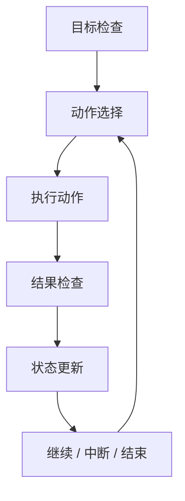

# 08 规划、分解与执行控制

> [!note] 课程说明
> **学习目标**：把 Agent 的“会做事”进一步拆成 `如何计划`、`如何执行`、`如何纠偏` 三个问题。  
> **前置知识**：建议先读完 [[02-Agent本体与系统边界]]、[[06-工具使用与环境交互]]。  
> **预计时间**：核心阅读 `55-75 分钟`，思考练习 `20-30 分钟`。  
> **本章任务**：回答四个问题，`什么时候需要显式规划`、`什么时候应该分解任务`、`执行控制如何设计`、`重试、中断、确认应该放在哪里`。

---

> [!question] 带着问题阅读
> 为什么很多 Agent 不是不会做事，而是不会有序地做事？它可能拿到目标后立刻行动、不断试错、偶尔成功，但整体过程不稳定。问题到底在模型能力，还是在控制环设计？

## 1. 为什么规划问题不是“可选优化”

很多 Agent 原型一开始都能跑，不需要显式规划。

它们通常靠的是一种简单模式：

- 看当前输入
- 直接决定下一步动作
- 看结果
- 再决定下一步

这在简单任务里完全可行。

但一旦任务开始变复杂，就会暴露几个问题：

- 容易漏步骤
- 容易过早行动
- 容易在错误路径上连续前进
- 容易在局部最优里打转

这时，问题往往不是“模型不会想”，而是系统没有为它提供合适的规划和执行控制框架。

> [!abstract] 定义
> 本章所说的“规划”，不是指一定要产出一份长计划，而是系统在行动前或行动中，对目标、步骤、依赖和完成路径进行明确化的过程；“执行控制”则是系统对行动推进、异常恢复、终止条件和确认机制的管理。

## 2. 不是所有任务都需要显式规划

规划很重要，但不是越重越好。

### 2.1 不需要复杂规划的场景

如果任务具有这些特征：

- 路径很短
- 动作空间很小
- 每一步几乎由上一步直接决定

那简单的逐轮决策通常就够了。

### 2.2 需要显式规划的场景

当任务出现这些特征时，显式规划会明显更有价值：

- 目标复杂
- 子任务之间存在依赖
- 工具调用成本高
- 错误代价高
- 路径很多、分支多

> [!tip] 原则
> 规划的价值，主要体现在降低无序试错和错误放大，而不是让系统看起来更“高级”。

## 3. 规划到底在解决什么

从系统角度看，规划主要解决三类问题。

### 3.1 目标分解

复杂目标如果不分解，系统很容易直接对着总目标硬冲。

结果通常是：

- 第一步就过于粗糙
- 中途不知道是否偏航
- 结束时也不知道算不算完成

### 3.2 顺序组织

很多任务不是“做什么”不清楚，而是“先做什么、后做什么”不清楚。

规划可以帮助系统建立：

- 依赖关系
- 执行顺序
- 先决条件

### 3.3 资源约束

工具预算、时间预算、风险预算，都会影响规划。

如果系统完全不感知这些约束，行动序列很容易不经济，甚至不安全。

## 4. 任务分解什么时候有价值，什么时候会害人

分解通常是规划的核心动作，但它并不总是好事。

### 4.1 分解有价值的时候

当任务可以自然拆成几个相对清晰的子问题时，分解有助于：

- 降低单步复杂度
- 提高过程可解释性
- 提升检查点质量

### 4.2 分解会害人的时候

当系统对任务理解本来就不稳定时，过早分解反而会放大错误。

因为一旦最初分解错了，后续每一步都会沿着错误结构推进。

### 4.3 一个实用判断

如果你连“任务的完成标准”都还没有说清，那通常还没到做细分解的时候。

## 5. 常见执行模式如何理解

### 5.1 ReAct：边想边做

ReAct 的优势在于：

- 轻
- 灵活
- 适合信息逐步揭示的任务

它的问题在于：

- 容易局部最优
- 容易忘掉全局路径

### 5.2 Plan-and-Execute：先规划再执行

这种模式适合：

- 步骤依赖较明显
- 任务复杂度较高
- 提前规划能减少代价高的试错

但它也有问题：

- 前置计划可能建立在不完整信息上
- 计划一旦僵化，就难以适应环境变化

### 5.3 Reflect / Critic：执行中自检

这类模式的价值在于：

- 不是一条路走到底
- 在关键点引入自我校验或外部校验

但如果校验点过多，也会带来：

- 成本上升
- 延迟增加
- 系统绕圈

> [!warning] 误区
> 执行模式不是越多越好。一个系统同时堆 ReAct、Plan、Reflect、Critic，不代表更强，常常只代表更重。

## 6. 控制环应该怎样设计

执行控制真正关心的是：**系统如何知道现在该推进、暂停、重试、回退还是结束。**

一个最基础的控制环，通常至少包括：

- 目标检查
- 动作选择
- 结果检查
- 状态更新
- 继续 / 终止判断

这个图看起来简单，但真正的系统质量差异，往往就出在这里。

## 7. 重试、回滚、中断、确认应该放在哪

### 7.1 重试

重试适合处理：

- 临时失败
- 超时
- 外部偶发抖动

但重试不是默认万能动作。

如果失败原因是：

- 权限不足
- 参数错误
- 目标理解错了

那继续重试通常没有意义。

### 7.2 回滚

回滚只在有副作用的系统里真正成立。

如果一个动作已经改写了环境，你必须知道：

- 是否可回滚
- 如何回滚
- 回滚代价是什么

### 7.3 中断

中断不是失败，它是控制能力的一部分。

需要中断的典型场景包括：

- 当前信息不足
- 风险过高
- 依赖条件未满足
- 任务目标发生变化

### 7.4 确认

确认是把控制权短暂交回人或上层策略。

它特别适合：

- 高风险动作
- 边界模糊动作
- 成本高动作

## 8. 执行中为什么需要重规划

现实环境不是静态的。

所以再好的前置计划，也可能在执行中失效。

重规划的价值就在于：

- 发现原计划不再适用
- 用新信息修正下一步路径
- 避免系统在旧计划上继续盲跑

### 8.1 触发重规划的常见信号

- 关键工具失败
- 新约束出现
- 外部环境变化
- 当前状态与计划预期不一致

### 8.2 重规划不等于推倒重来

很多系统把“发现偏差”理解成“重做一切”。

这往往代价过高。

更好的重规划，通常是局部修正：

- 调整接下来的几步
- 更新优先级
- 改变终止条件

## 9. 人在回路不是保守，而是分工

很多人把 Human-in-the-loop 理解成：

- 系统不够强，所以才要人审

这种理解太浅了。

更准确地说，人在回路是在处理两类问题：

- 风险不可完全自动化
- 某些判断更适合由人承担最终责任

所以，人在回路不是能力失败，而是控制权分配的一部分。

## 10. 规划与执行的典型反模式

### 10.1 一拿目标就立即行动

没有任务澄清，没有边界检查，系统拿到目标后立刻调用工具。

这通常会带来：

- 过早行动
- 错误路径放大

### 10.2 先规划一大堆，但执行不看计划

系统形式上有计划，执行上却完全脱节。

这类计划只是装饰，不是控制结构。

### 10.3 只会重试，不会停

一旦失败，系统默认重复动作，直到预算耗尽。

这不是韧性，是无效循环。

### 10.4 把所有子问题都过度拆分

过度分解会让系统变得：

- 更慢
- 更碎
- 更难维护全局目标

## 11. 一个可复用的规划与执行检查框架

### 11.1 当前任务真的需要显式规划吗

如果任务简单短链，别为了“高级感”强上重规划。

### 11.2 当前计划能否指导下一步动作

如果计划和执行完全脱节，那计划没有价值。

### 11.3 系统是否知道什么时候该停

没有完成标准和终止条件，系统很容易无限推进。

### 11.4 遇到异常时，系统会重试、重规划还是中断

如果这三者没有被区分，控制环通常是不成熟的。

## 12. 本章应当留下的认知结论

读完这一章，你至少应该建立这些判断。

- 规划不是可选装饰，而是复杂任务中的控制能力
- 不是所有任务都需要重规划，但复杂任务通常需要某种显式控制
- ReAct、Plan-and-Execute、Reflect 等模式，本质上是在不同位置分配控制权
- 重试、回滚、中断、确认是不同控制动作，不能混用
- 人在回路是控制权设计，不只是安全补丁

## 本章结构图

## 一页总结

- 规划不是装饰，而是复杂任务中的控制能力。
- 不是所有任务都需要重规划，但复杂任务通常需要某种显式控制。
- ReAct、Plan-and-Execute、Reflect 的差异，本质是控制权落点不同。
- 重试、回滚、中断、确认是不同控制动作，不能混成一种失败处理。
- 人在回路是控制权分工，而不是能力失败的遮羞布。

## 思考练习

> [!question] 思考练习
> 选一个你熟悉的 Agent 系统，尝试回答下面的问题：
> 1. 它现在更接近 ReAct 还是 Plan-and-Execute？
> 2. 它有没有清晰的终止条件？
> 3. 它在失败时默认做的是重试、重规划还是中断？
> 4. 如果你要提升它的稳定性，会先改规划层、执行层，还是确认机制？

## 关联阅读
- [[06-工具使用与环境交互]]
- [[09-Workflow与多Agent协作]]
- [[10-可靠性与失败模式]]

## 延伸阅读

**必读**

- [ReAct: Synergizing Reasoning and Acting in Language Models](https://arxiv.org/pdf/2210.03629)
- [Tree of Thoughts: Deliberate Problem Solving with Large Language Models](https://huggingface.co/papers/2305.10601)

**延伸**

- [Self-Refine: Iterative Refinement with Self-Feedback](https://huggingface.co/papers/2303.17651)
- [Building effective agents | Anthropic](https://www.anthropic.com/engineering/building-effective-agents)
