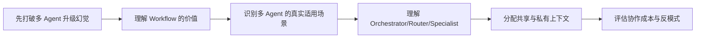

# 09 Workflow与多Agent协作

> [!note] 课程说明
> **学习目标**：回答系统什么时候该停留在单 Agent，什么时候应该抽成 Workflow，什么时候才值得升级到多 Agent。  
> **前置知识**：建议先读完 [[02-Agent本体与系统边界]]、[[08-规划、分解与执行控制]]。  
> **预计时间**：核心阅读 `55-75 分钟`，思考练习 `20-30 分钟`。  
> **本章任务**：回答四个问题，`Workflow 适合什么`、`多 Agent 真正解决什么`、`共享与私有上下文如何分配`、`为什么多 Agent 常常只是复杂化`。

---

> [!question] 带着问题阅读
> 为什么很多系统一从单 Agent 升级成 Workflow 或多 Agent，看起来架构更复杂了，结果却没有更稳定，反而更难调试、更难评估、更贵？问题出在模型不够强，还是架构升级本身并不总成立？

## 1. 为什么“多 Agent”常被误解成升级

在很多讨论里，架构演进似乎有一条默认路径：

- 先做 Prompt
- 再做单 Agent
- 再做 Workflow
- 最后做多 Agent

这条路径听起来很自然，但它最大的问题是暗示了一种错误前提：

> 越往后越高级。

现实里并不是这样。

很多时候：

- Workflow 是更好的答案
- 单 Agent 已经足够
- 多 Agent 只是把原本没解决的问题分散到更多模块里

所以，本章最重要的任务不是教你“如何做多 Agent”，而是先建立一个更成熟的判断：**什么时候根本不应该升级。**

## 2. Workflow 在解决什么问题

Workflow 的价值，不在于它“没那么智能”，而在于它能把稳定部分收回来。

当任务具有这些特征时，Workflow 通常很强：

- 步骤大致明确
- 分支大致已知
- 每个阶段职责清楚
- 系统更看重稳定性而不是探索性

这时，把流程写清楚，通常比把控制权完全交给运行时判断更稳。

### 2.1 Workflow 的真正优势

- 控制边界清楚
- 过程可解释
- 测试容易
- 风险更容易局部化

### 2.2 Workflow 的代价

- 适应性较弱
- 对未知路径支持有限
- 流程一旦变化，维护成本可能上升

## 3. 多 Agent 真正解决的是什么问题

多 Agent 只有在某些特定复杂度下才真正有价值。

它最适合解决的问题通常不是“一个 Agent 不够聪明”，而是：

- 需要多个清晰分工的决策中心
- 需要不同能力边界
- 需要隔离不同上下文负担
- 需要隔离不同权限或角色

### 3.1 多 Agent 的真正价值

真正有价值的多 Agent，通常至少满足一种情况：

- 不同子问题之间可以部分独立推进
- 不同 Agent 需要不同工具集
- 不同 Agent 需要不同上下文视角
- 不同 Agent 的职责边界天然可拆

### 3.2 多 Agent 不能自动解决什么

多 Agent 不能自动解决：

- 目标不清
- 状态混乱
- 工具失真
- 评测缺失

如果这些基础问题没解决，多 Agent 只会把问题复制到更多节点上。

> [!warning] 误区
> 多 Agent 的真正门槛，不是“能不能启动多个模型实例”，而是“这些实例之间是否真的存在合理分工”。

## 4. 单 Agent、Workflow、多 Agent 如何区分

一个实用区分方式，是看控制权和职责是怎样分配的。

### 4.1 单 Agent

适合：

- 一个决策中心基本足够
- 上下文还能被单一控制环稳定管理
- 工具集规模仍可控

### 4.2 Workflow

适合：

- 系统的大部分路径已经明确
- 更需要稳定流程，而不是高自由度探索

### 4.3 多 Agent

适合：

- 确实存在多个分工明确、上下文可隔离的决策单元
- 单一控制环已经难以稳定容纳全部复杂度

## 5. Orchestrator、Router、Specialist 这些角色怎么理解

这些不是时髦名词，它们本质上是在回答：

- 谁负责分配任务
- 谁负责执行局部问题
- 谁负责决定该找谁

### 5.1 Orchestrator

Orchestrator 更接近总控。

它的职责通常包括：

- 理解全局目标
- 分配任务
- 汇总结果

### 5.2 Router

Router 更接近分类与分发。

它不一定负责推进完整任务，但负责判断：

- 当前问题该交给哪个能力单元

### 5.3 Specialist

Specialist 更接近局部专家。

它的价值在于：

- 上下文负担更小
- 职责更清楚
- 工具集更聚焦

## 6. 共享上下文与私有上下文如何分配

这是多 Agent 最容易做坏的地方之一。

### 6.1 共享上下文太少的问题

如果共享太少，不同 Agent 很容易：

- 各说各话
- 目标不一致
- 重复做事

### 6.2 共享上下文太多的问题

如果共享太多，又会导致：

- 每个 Agent 都背着大量无关信息
- 私有职责被共享噪音污染
- 协作成本反而上升

### 6.3 一个实用原则

更好的默认策略通常是：

- 共享目标、关键约束、关键状态
- 私有局部材料、局部工具结果、局部推理负担

> [!tip] 原则
> 在多 Agent 里，不是“共享越多越好”，而是“该共享的只共享全局关键，不该共享的让局部自己消化”。

## 7. 多 Agent 中的状态一致性为什么难

一旦系统里不止一个决策单元，状态一致性就会立刻成为问题。

典型难点包括：

- 不同 Agent 对当前阶段理解不同
- 一个 Agent 更新了状态，另一个还在使用旧状态
- 局部结论与全局目标不一致

这类问题本质上不是模型问题，而是协作系统问题。

## 8. 协作开销为什么经常被低估

很多团队低估了多 Agent 的隐性成本。

这些成本包括：

- 角色定义成本
- 协议设计成本
- 状态同步成本
- 调试成本
- 评测成本

一个单 Agent 的问题，很多时候你还能沿着一条主链路调试。
一个多 Agent 系统的问题，常常会变成：

- 是分发错了
- 还是执行错了
- 还是汇总错了
- 还是共享状态错了

## 9. 多 Agent 的典型反模式

### 9.1 职责假分工型

表面上拆成很多 Agent，实际上它们的职责高度重叠。

这种拆法只会增加通信，而不会增加清晰度。

### 9.2 单 Agent 问题外溢型

本来只是一个上下文或状态问题，但被解释为“需要再加一个 Planner / Critic / Reviewer”。

### 9.3 共享一切型

所有 Agent 都拿全部上下文。

结果是：

- 没有真正减负
- 复杂度反而更高

### 9.4 汇总点失真型

局部 Specialist 都输出得不错，但总控在汇总时把重点搞丢。

这类问题在多 Agent 系统里非常常见。

## 10. 一个可复用的架构选择框架

### 10.1 这个问题真的需要多个决策中心吗

如果不需要，单 Agent 或 Workflow 往往更好。

### 10.2 这些子任务是否天然可分

如果分工边界说不清，多 Agent 多半不值。

### 10.3 共享信息是否可控

如果共享关系复杂到说不清，系统后面会很难稳。

### 10.4 协作成本是否值得

不是“能做多 Agent”就应该做，而是“多 Agent 带来的收益是否大于协作成本”。

## 11. 本章应当留下的认知结论

读完这一章，你至少应该建立这些判断。

- Workflow 不是低配版 Agent，它是在收回稳定部分的控制权
- 多 Agent 只有在存在真实分工和上下文隔离价值时才值得
- 单 Agent、Workflow、多 Agent 的关键区别在控制权和职责划分
- 共享上下文与私有上下文的分配，是多 Agent 设计的核心难点
- 很多多 Agent 项目失败，不是模型不够强，而是协作系统本身没有设计好

## 本章结构图

## 一页总结

- Workflow 不是低配版 Agent，而是在收回稳定部分的控制权。
- 多 Agent 只有在真实分工、上下文隔离和权限隔离成立时才值得。
- 多一个 Agent，不等于多一份能力，往往先多一份协作成本。
- 共享上下文与私有上下文的分配，是多 Agent 稳定性的核心。
- 很多多 Agent 项目失败，本质是协作系统没设计好。

## 思考练习

> [!question] 思考练习
> 选一个你熟悉的 Agent 系统，尝试回答下面的问题：
> 1. 它当前更适合保持单 Agent、改成 Workflow，还是拆成多 Agent？
> 2. 如果要拆，多出来的每个 Agent 的职责能否一句话说清？
> 3. 哪些信息应该共享，哪些只该局部持有？
> 4. 如果现在它已经是多 Agent，最大的问题更可能出在路由、执行、同步还是汇总？

## 关联阅读
- [[02-Agent本体与系统边界]]
- [[08-规划、分解与执行控制]]
- [[13-成本、性能与扩展性]]

## 延伸阅读

**必读**

- [Building effective agents | Anthropic](https://www.anthropic.com/engineering/building-effective-agents)
- [Multi-agent | LangChain Docs](https://docs.langchain.com/oss/python/langchain/multi-agent/index)

**延伸**

- [LangGraph overview | LangChain Docs](https://docs.langchain.com/oss/python/langgraph/overview)
- [Building Effective AI Agents eBook | Anthropic](https://resources.anthropic.com/building-effective-ai-agents)
