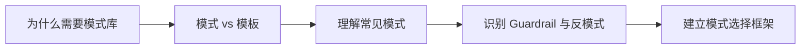

# 14 设计模式库

> [!note] 课程说明
> **学习目标**：把前面 13 章的方法论收束成一组可复用的设计模式和反模式，帮助你在新项目里更快做出结构判断。  
> **前置知识**：建议先完成主线阅读后再进入本章。  
> **预计时间**：核心阅读 `45-60 分钟`，配合设计练习 `20-30 分钟`。  
> **本章任务**：回答三个问题，`有哪些常见模式`、`每种模式适合什么问题`、`什么情况下这些模式会变成反模式`。

---

> [!question] 带着问题阅读
> 当你开始设计一个新 Agent 时，为什么最容易出现的不是“不会做”，而是“每次都从零开始重新想一遍”？如果模式能复用，那复用的到底应该是什么？

## 1. 为什么需要模式库

真正成熟的工程体系，不会每次做新系统都从白纸开始。

Agent 设计也一样。

如果前 13 章提供的是：

- 概念边界
- 结构原则
- 运行机制
- 工程闭环

那么这一章要做的，是把这些原则沉淀成一组更短的设计模式。

模式的价值不在于“省去思考”，而在于：

- 让你不用每次都重建底层语言
- 让团队更容易达成共识
- 让常见问题有可复用解法

> [!abstract] 定义
> 本章所说的“模式”，不是某个具体框架实现，而是在一类问题里反复证明有价值的结构组合；“反模式”则是在很多场景下看似合理、实际经常带来系统性问题的做法。

## 2. 模式不是模板，模式是在回答结构问题

一个模板告诉你“怎么填”。

一个模式则回答：

- 这类问题应该如何组织目标、状态、上下文、工具和控制
- 哪种复杂度值得什么样的架构

所以，模式适合解决的是：

- 起步时的架构判断
- 中途的结构修正
- 复盘时的模式识别

## 3. 任务型 Agent 模式

### 3.1 适用问题

适合：

- 有明确任务目标
- 目标复杂度中等
- 需要动态决策，但不需要复杂协作

### 3.2 关键结构

- 明确任务定义
- 显式状态摘要
- 少量必要工具
- 轻量控制环

### 3.3 典型风险

- 容易把当前任务做成“什么都接一点”
- 状态管理不清会迅速失稳

## 4. 搜索与研究型 Agent 模式

### 4.1 适用问题

适合：

- 信息不在模型参数里
- 需要不断检索、筛选、比较
- 最终产出带有综合判断

### 4.2 关键结构

- 明确检索触发条件
- 强调证据筛选与摘要
- 重视中间结论，而不是原始材料堆积

### 4.3 典型风险

- 检索结果全灌入上下文
- 搜集材料变成伪目标

## 5. Coding Agent 模式

### 5.1 适用问题

适合：

- 面向代码库、命令行、测试链路
- 任务需要读环境、改环境、验证环境

### 5.2 关键结构

- 工具边界清晰
- 状态里显式包含当前任务进展
- 验证步骤不可省

### 5.3 典型风险

- 把能执行误当成应该执行
- 高风险写操作没有确认边界

## 6. 审批与决策辅助模式

### 6.1 适用问题

适合：

- 需要分析和建议
- 最终决策仍应由人承担

### 6.2 关键结构

- 人在回路是主设计，不是补丁
- 系统更偏“建议、归纳、对比、提醒”

### 6.3 典型风险

- 系统输出建议，却被业务误当成自动决策

## 7. Guardrail 模式

这一类模式不是独立产品形态，而是：

- 用于限制错误传播
- 用于给高风险动作加边界

常见形式包括：

- 确认点
- 权限分层
- 关键状态复核
- 失败后中断而不是盲进

## 8. 什么时候模式会变成反模式

模式一旦脱离适用边界，就会反过来变成反模式。

### 8.1 重规划成瘾

任务很简单，却强行做复杂规划。

### 8.2 多 Agent 迷信

单 Agent 问题没解，就急着拆分协作系统。

### 8.3 工具大礼包

为了模式看起来“完整”，一次性接上太多工具。

### 8.4 模板崇拜

无论问题类型如何，都用同一套模式硬套。

> [!warning] 误区
> 模式的价值在于加快正确判断，不在于替代判断本身。

## 9. 一个可复用的模式选择框架

### 9.1 这类问题的核心复杂度来自哪里

- 信息复杂
- 工具复杂
- 状态复杂
- 协作复杂

### 9.2 单一控制环是否足够

如果足够，别急着上 Workflow 或多 Agent。

### 9.3 这类模式带来的额外成本是否值得

每一种模式都不是免费结构。

### 9.4 如果失败，最可能先坏在哪

模式选择时就该预想失效方式。

## 10. 本章应当留下的认知结论

读完这一章，你至少应该建立这些判断。

- 模式库的意义是复用结构判断，不是复用表面做法
- 不同问题类型适合不同结构模式
- 模式一旦超出适用边界，就会退化成反模式
- 会选模式，通常比会堆能力更重要

## 本章结构图

## 一页总结

- 模式库复用的是结构判断，不是表面做法。
- 不同问题类型适合不同的结构模式。
- 模式超出适用边界就会退化成反模式。
- 会选模式，比会堆能力更重要。

## 思考练习

> [!question] 思考练习
> 选一个你准备做或正在做的 Agent 项目，尝试回答下面的问题：
> 1. 它更接近哪一种模式？
> 2. 这类模式最常见的失败方式是什么？
> 3. 如果只保留一个核心模式，你会保留什么？
> 4. 你当前方案里最大的反模式风险是什么？

## 使用建议
- 先看 [[02-Agent本体与系统边界]]，确认问题是不是 Agent 问题
- 再回到这里选模式
- 最后配合 [[16-模板、清单与工作台]] 输出设计文档

## 延伸阅读

**必读**

- [Building effective agents | Anthropic](https://www.anthropic.com/engineering/building-effective-agents)
- [Multi-agent | LangChain Docs](https://docs.langchain.com/oss/python/langchain/multi-agent/index)

**延伸**

- [ReAct: Synergizing Reasoning and Acting in Language Models](https://arxiv.org/pdf/2210.03629)
- [Toolformer: Language Models Can Teach Themselves to Use Tools](https://huggingface.co/papers/2302.04761)
